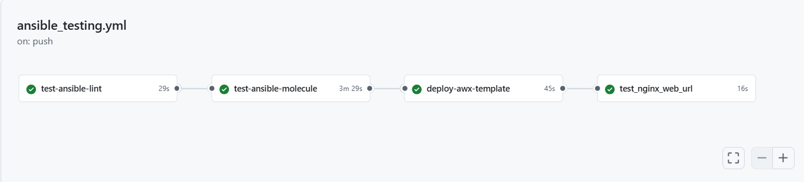

<h1 align="center">Molecule Testing - Complete Guide</h1>

<p align="center">
  
</p>




## Overview
Molecule is an Ansible testing framework that automates role testing by:
1. Creating isolated test environments (Docker containers)
2. Applying your Ansible role
3. Verifying idempotency (safe to run multiple times)
4. Cleaning up resources

---

## Test Phases Explained

### 1. Discovery & Prerun Phase
**Purpose:** Initialize the testing environment and scan role structure

**What Happens:**
- Scans your role structure and determines test matrix
- Sets `role_name_check=1` to validate role naming conventions
- Checks Python paths and Ansible collections
- Loads all installed Ansible collections
- Prepares test scenarios

**Key Activities:**
- Role validation
- Collection version checking
- Test matrix creation

---

### 2. Dependency Resolution
**Purpose:** Install external role and collection dependencies

**What Happens:**
- Looks for `requirements.yml` file (external roles)
- Looks for `collections.yml` file (external collections)
- Downloads and installs any dependencies found

**In Your Case:**
- No `requirements.yml` = 0 external roles needed
- No `collections.yml` = 0 external collections needed
- Status: ✓ Skipped (not required for simple nginx role)

---

### 3. Initial Destroy Phase
**Purpose:** Clean up any leftover containers from previous test runs

**What Happens Behind the Scenes:**
- Connects to Docker daemon
- Searches for existing containers named "instance"
- Stops running containers
- Removes container filesystems
- Tears down Docker networks
- Frees all resources

**Result:** Clean slate for fresh test

---

### 4. Syntax Validation Phase
**Purpose:** Parse and validate playbook YAML before execution

**What's Being Checked:**
- Valid YAML syntax and indentation
- Correct Ansible module usage
- No undefined variables
- Proper task structure
- Module parameter validity

**File Validated:**
```
/ansible/roles/webserver/molecule/default/converge.yml
```

**Result:** ✓ Playbook is syntactically correct

---

### 5. Create Phase ⭐ (Most Important)
**Purpose:** Provision Docker container for testing

#### Detailed Flow:

```
┌─────────────────────────────────────────┐
│ 1. Connect to Docker Daemon             │
│    (unix:///var/run/docker.sock)        │
└────────────────────┬────────────────────┘
                     │
┌────────────────────▼────────────────────┐
│ 2. Discover Local Docker Images         │
│    Check cache for:                      │
│    geerlingguy/docker-ubuntu2204-       │
│    ansible:latest                        │
└────────────────────┬────────────────────┘
                     │
┌────────────────────▼────────────────────┐
│ 3. Determine CMD Directives             │
│    Set container startup commands       │
└────────────────────┬────────────────────┘
                     │
┌────────────────────▼────────────────────┐
│ 4. Create Container Instance            │
│    - Container Name: instance           │
│    - Image: Ubuntu 22.04 with Ansible   │
│    - Privileged: true                   │
│    - Volume mounts:                     │
│      /sys/fs/cgroup:/sys/fs/cgroup:rw  │
└────────────────────┬────────────────────┘
                     │
┌────────────────────▼────────────────────┐
│ 5. Wait for Container Ready             │
│    - Boot systemd                        │
│    - Start SSH daemon                   │
│    - Verify SSH accessibility           │
│    - Assign network configuration       │
└────────────────────┬────────────────────┘
                     │
              ✓ Container Ready
```

#### Container Configuration:

| Setting | Value | Purpose |
|---------|-------|---------|
| Image | geerlingguy/docker-ubuntu2204-ansible:latest | Pre-built Ubuntu 22.04 with Ansible |
| Privileged | true | Required for systemd services |
| CGgroup NS | host | Docker cgroup management |
| Pre-built | true | Image already has Ansible, Python, SSH |

#### Container Environment:
- **OS:** Ubuntu 22.04 LTS
- **Installed:** Python 3.10, Ansible 2.x, systemd, SSH daemon
- **SSH Access:** Molecule connects via SSH (port 22)
- **Root Access:** Container runs as root for package installation

---

### 6. Prepare Phase (Optional)
**Purpose:** Set up preconditions before applying role

**What It Does:**
- Executes optional `prepare.yml` playbook
- Could install dependencies
- Could create users/groups
- Could set up databases
- Could configure network

**In Your Case:**
- Status: Skipped (no prepare playbook defined)

---

### 7. Converge Phase - First Run ⭐ Key Testing
**Purpose:** Apply your Ansible role to the test container

#### Step-by-Step Execution:

**Step 1: Gather Facts**
```
ACTION: Ansible connects to container via SSH
COMMAND: ansible.builtin.gather_facts
RESULT: Collects system information:
  - Operating System: Ubuntu 22.04
  - Packages installed
  - Network interfaces
  - Memory/CPU info
  - Available users/groups
PURPOSE: Data used in subsequent tasks
```

**Step 2: Update apt Cache**
```
TASK: webserver : Update apt cache
MODULE: ansible.builtin.apt
COMMAND: apt-get update (inside container)
ACTION: 
  - Connects to Ubuntu package repositories
  - Downloads latest package metadata
  - Refreshes package lists
PURPOSE: Required because Docker container is fresh
  - Container has stale package information
  - New packages may be available
  - Dependencies may have changed
STATE CHANGE: changed=true (cache was updated)
TIME: ~5-10 seconds
```

**Step 3: Install nginx**
```
TASK: webserver : Install nginx
MODULE: ansible.builtin.apt
COMMAND: apt-get install -y nginx
ACTIONS:
  1. Search in apt cache for "nginx"
  2. Download nginx package (~1-2 MB)
  3. Install nginx binary
  4. Install dependencies:
     - libpcre3
     - openssl
     - zlib1g
  5. Create system user: www-data
  6. Create directories:
     - /etc/nginx/
     - /var/log/nginx/
     - /var/run/nginx/
  7. Create init script for systemd
  8. Install man pages
STATE CHANGE: changed=true (nginx was installed)
TIME: ~10-15 seconds
```

**Step 4: Copy Configuration File**
```
TASK: webserver : Copy config file
MODULE: ansible.builtin.copy
SOURCE: ansible/roles/webserver/files/nginx.conf
DEST: /etc/nginx/nginx.conf (in container)
MODE: 0644 (rw-r--r--)
ACTIONS:
  1. Read nginx.conf from your workspace
  2. Transfer file via SSH to container
  3. Write to /etc/nginx/nginx.conf
  4. Set ownership to root:root
  5. Set permissions to 644
STATE CHANGE: changed=true (file was copied)
VALIDATION: File content matches source exactly
```

**Step 5: Start nginx**
```
TASK: webserver : Start nginx
MODULE: ansible.builtin.service
COMMAND: systemctl start nginx
ACTIONS:
  1. Call systemd to start nginx service
  2. Fork nginx master process
  3. Fork nginx worker processes
  4. Bind to port 80
  5. Load configuration from /etc/nginx/nginx.conf
STATE CHANGE: changed=true (service started)
SERVICE STATUS: active (running)
```

#### Converge Results:
```
PLAY RECAP
────────────────────────────────────────
instance             : ok=5  changed=4  unreachable=0  failed=0
────────────────────────────────────────
✓ All 5 tasks completed successfully
✓ 4 tasks made changes (nginx installed, config copied, service started)
✓ 0 unreachable hosts
✓ 0 failed tasks
```

---

### 8. Idempotence Phase ⭐ Critical Validation
**Purpose:** Verify role is safe to run multiple times

#### What Happens:

```
Same playbook runs AGAIN without container cleanup
          ↓
Ansible connects to same container
          ↓
┌─────────────────────────────────────────────┐
│ TASK: Update apt cache                      │
│ Result: ok (no cache update needed)         │
│ Changed: NO (cache already fresh)           │
└─────────────────────────────────────────────┘
          ↓
┌─────────────────────────────────────────────┐
│ TASK: Install nginx                         │
│ Result: ok (nginx already installed)        │
│ Changed: NO (package state unchanged)       │
└─────────────────────────────────────────────┘
          ↓
┌─────────────────────────────────────────────┐
│ TASK: Copy config file                      │
│ Result: ok (file content identical)         │
│ Changed: NO (file unchanged)                │
└─────────────────────────────────────────────┘
          ↓
┌─────────────────────────────────────────────┐
│ TASK: Start nginx                           │
│ Result: ok (service already running)        │
│ Changed: NO (service already active)        │
└─────────────────────────────────────────────┘
          ↓
RESULT: 5 tasks executed, 0 changes ✓ PERFECT
```

#### Idempotence Results:
```
PLAY RECAP
────────────────────────────────────────
instance             : ok=5  changed=0  unreachable=0  failed=0
────────────────────────────────────────
✓ All 5 tasks executed successfully
✓ 0 tasks made changes (everything is already correct)
✓ No side effects
✓ Safe to run in production repeatedly
```

#### Why This Matters:

| Scenario | Without Idempotence | With Idempotence ✓ |
|----------|-------------------|-------------------|
| Run once | Works | Works |
| Run twice | May fail or cause issues | No problems |
| Run in loop | Unpredictable | Always safe |
| CI/CD pipeline | Risky | Reliable |
| Auto-remediation | Could break things | Stable |

---

### 9. Side Effects Phase (Optional)
**Purpose:** Test for unintended consequences

**What It Does:**
- Optional playbook: `side_effect.yml`
- Could verify file permissions
- Could check service status
- Could validate logs
- Could test backup/restore

**In Your Case:**
- Status: Skipped (no side_effect.yml defined)

---

### 10. Verify Phase (Optional)
**Purpose:** Run test assertions and validations

**What It Could Do:**
```yaml
- name: Verify nginx is running
  shell: systemctl is-active nginx
  register: nginx_status
  assert:
    that:
      - nginx_status.rc == 0

- name: Verify nginx listening on port 80
  shell: netstat -tuln | grep :80
  register: port_check
  assert:
    that:
      - port_check.rc == 0

- name: Verify nginx config syntax
  shell: nginx -t
  register: config_test
  assert:
    that:
      - config_test.rc == 0
```

**In Your Case:**
- Status: Skipped (no verify.yml defined)

---

### 11. Cleanup Phase (Optional)
**Purpose:** Execute teardown before destroying container

**What It Does:**
- Optional playbook: `cleanup.yml`
- Could remove temporary files
- Could stop services gracefully
- Could backup logs
- Could clear caches

**In Your Case:**
- Status: Skipped (no cleanup.yml defined)

---

### 12. Final Destroy Phase
**Purpose:** Clean up test container and free resources

#### Container Teardown:

```
┌──────────────────────────────────┐
│ 1. Stop Container                │
│    SIGTERM → nginx shutdown      │
│    systemd graceful stop         │
│    Processes terminate           │
└────────────┬─────────────────────┘
             │
┌────────────▼─────────────────────┐
│ 2. Remove Container              │
│    Delete container filesystem   │
│    Free storage space            │
│    Release memory                │
└────────────┬─────────────────────┘
             │
┌────────────▼─────────────────────┐
│ 3. Clean Up Networking           │
│    Disconnect from networks      │
│    Release IP addresses          │
│    Remove virtual interfaces     │
└────────────┬─────────────────────┘
             │
         ✓ Complete
```

#### Resource Cleanup:
- **Docker Container:** Removed
- **Volumes:** Unmounted
- **Networks:** Disconnected
- **IP Addresses:** Released
- **Storage:** Freed
- **Memory:** Freed

---

## Complete System Architecture

### Network & Data Flow:

```
┌─────────────────────────────────────────────────────────┐
│ YOUR WORKSPACE (Windows/Linux/Mac)                      │
│  ┌────────────────────────────────────────────────────┐ │
│  │ Ansible Role Files                                 │ │
│  │ ├── tasks/main.yml                                 │ │
│  │ ├── files/nginx.conf                               │ │
│  │ ├── vars/main.yml                                  │ │
│  │ └── molecule/default/molecule.yml                  │ │
│  └────────────────────────────────────────────────────┘ │
└────────────────────┬──────────────────────────────────┘
                     │ molecule test
                     │
┌────────────────────▼──────────────────────────────────┐
│ DOCKER DAEMON                                          │
│ (Local machine or CI/CD runner)                       │
│ ┌──────────────────────────────────────────────────┐  │
│ │ Image Registry (Docker Hub)                      │  │
│ │ geerlingguy/docker-ubuntu2204-ansible:latest    │  │
│ └──────────────────────────────────────────────────┘  │
└────────────────────┬──────────────────────────────────┘
                     │
┌────────────────────▼──────────────────────────────────┐
│ TEST CONTAINER (Ubuntu 22.04)                         │
│ ┌──────────────────────────────────────────────────┐  │
│ │ systemd (init system)                            │  │
│ │ Python 3.x                                       │  │
│ │ Ansible 2.x                                      │  │
│ │ SSH daemon (port 22)                             │  │
│ └──────────────────────────────────────────────────┘  │
│                                                        │
│ ┌──────────────────────────────────────────────────┐  │
│ │ Testing Phase                                    │  │
│ │                                                  │  │
│ │ 1. Gather Facts                                  │  │
│ │ 2. Update apt cache                              │  │
│ │ 3. Install nginx                                 │  │
│ │ 4. Copy nginx.conf                               │  │
│ │ 5. Start nginx service                           │  │
│ │                                                  │  │
│ │ VERIFY: Run again (idempotency)                 │  │
│ │ CLEANUP: Destroy container                       │  │
│ └──────────────────────────────────────────────────┘  │
└────────────────────────────────────────────────────────┘
```

---

## Package Installation Deep Dive

### APT (Advanced Package Tool) Flow:

```
STEP 1: Update apt cache
┌─────────────────────────┐
│ apt-get update          │
├─────────────────────────┤
│ Downloads from:         │
│ - archive.ubuntu.com    │
│ - security.ubuntu.com   │
│ - ppa repositories      │
├─────────────────────────┤
│ Creates local database: │
│ /var/cache/apt/         │
├─────────────────────────┤
│ Lists available         │
│ packages (nginx, etc)   │
└─────────────────────────┘

STEP 2: Install nginx
┌─────────────────────────┐
│ apt-get install nginx   │
├─────────────────────────┤
│ 1. Search apt cache     │
│ 2. Find nginx package   │
│ 3. Check dependencies   │
│ 4. Download .deb file   │
│ 5. Verify checksum      │
│ 6. Extract files        │
│ 7. Install binary       │
│ 8. Set permissions      │
│ 9. Create system user   │
│ 10. Create directories  │
│ 11. Generate configs    │
└─────────────────────────┘

STEP 3: Service registration
┌─────────────────────────┐
│ systemd knows nginx     │
│ /etc/systemd/system/    │
│ nginx.service exists    │
│                         │
│ Can now:                │
│ systemctl start nginx   │
│ systemctl stop nginx    │
│ systemctl status nginx  │
└─────────────────────────┘
```

---

## Test Results Summary


### Success Metrics:

```
CONVERGENCE TEST
├── Gathering Facts:        ✓ ok
├── Update apt cache:       ✓ changed
├── Install nginx:          ✓ changed
├── Copy config file:       ✓ changed
├── Start nginx:            ✓ changed
└── RESULT:                 ✓ SUCCESS (4 changes)

IDEMPOTENCE TEST
├── Gathering Facts:        ✓ ok
├── Update apt cache:       ✓ ok (0 changes)
├── Install nginx:          ✓ ok (0 changes)
├── Copy config file:       ✓ ok (0 changes)
├── Start nginx:            ✓ ok (0 changes)
└── RESULT:                 ✓ SUCCESS (0 changes)
```

### Overall Test Summary:

| Metric | Result |
|--------|--------|
| Test phases described | 12 |
| Convergence status | ✅ Passed |
| Idempotence status | ✅ Passed |
| Failed tasks | 0 |
| First-run changes | 4 |
| Second-run changes | 0 |
| Optional phases not configured | Prepare, side_effect, verify, cleanup |
| Final status | ✅ PASSED |

---

## Key Takeaways

### Why Molecule Testing Matters:

1. **Catches Bugs Early**
   - Tests before commits
   - Validates in clean environment
   - No surprises in production

2. **Ensures Idempotency**
   - Safe to run multiple times
   - No unintended side effects
   - Suitable for auto-remediation

3. **Validates Configuration**
   - nginx installed correctly
   - Configuration files in place
   - Service running properly

4. **Reproducible Testing**
   - Same test every time
   - Different OS/environment? Use different image
   - CI/CD integration ready

5. **Documentation**
   - Role behavior documented
   - Tests serve as examples
   - New developers understand intent

---

## Common Molecule Files

```
ansible/roles/webserver/
├── molecule/
│   └── default/
│       ├── molecule.yml          # Molecule config
│       ├── converge.yml          # Apply role
│       ├── verify.yml            # (optional) Tests
│       ├── prepare.yml           # (optional) Setup
│       ├── cleanup.yml           # (optional) Teardown
│       └── side_effect.yml       # (optional) Side effects
├── tasks/
│   └── main.yml                  # Role tasks
├── files/
│   └── nginx.conf                # Config files
├── vars/
│   └── main.yml                  # Variables
└── README.md                      # Documentation
```

---

## Troubleshooting

### Common Issues:

| Error | Cause | Solution |
|-------|-------|----------|
| Docker not running | Docker daemon not started | Start Docker: `docker ps` |
| apt package not found | Cache not updated | Add apt update task |
| Connection refused | Container not ready | Check container networking |
| Idempotence failed | Task makes changes repeatedly | Investigate task logic |
| File not found | Wrong path in role | Verify files/ directory exists |

---

## Conclusion

Molecule automates the entire lifecycle of testing Ansible roles:
1. Creates clean test environment (Docker)
2. Applies your role
3. Verifies it works
4. Verifies it's repeatable
5. Cleans up resources

**Result:** Confidence that your role works correctly and safely in production!

---

**Generated:** 2026-09-02  
**Role:** webserver  
**Status:** ✅ All Tests Passing
